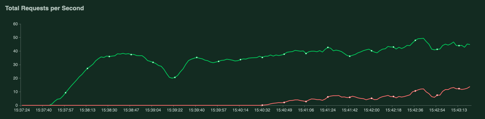
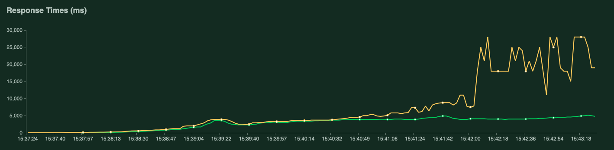
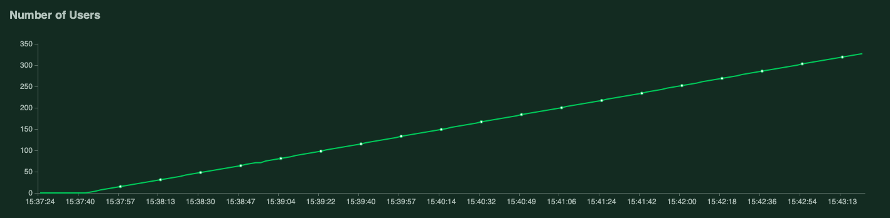

# Ingénierie logicielle pour l'IA

       

_Auteurs:_ [Simon Audrix](mailto:saudrix@ensc.fr) & [Gabriel Nativel-Fontaine](mailto:gnativ910e@ensc.fr)

Ce dépôt contient une API qui expose un modèle de réseau de neurones entraîné pour reconnaitre des intentions dans des phrases.

Il a été réalisé dans le cadre du module **Ingénierie logicielle pour l'IA** du parcours **Intelligence Artificielle** inscrit dans la 3ème année du cursus d'ingénieur au sein de l'[École Nationale Supérieure de Cognitique](http://www.ensc.fr).

Le dossier notebook contient les notebook nous ayant permis de répondre aux questions posées pour ce projet:

- [Analyse de l'existant](https://github.com/3a-ia-ensc/glog_4_ai/blob/main/notebooks/html/Analyses%20de%20l'existant.html) répond aux questions sur l'analyse du modèle précédent (Exercices 1 & 2)
- [Création d'un modèle](https://github.com/3a-ia-ensc/glog_4_ai/blob/main/notebooks/html/Création%20d'un%20modèle.html) répond présente notre démarche de création d'un nouveau modèle et la comparaison avec le modèle précédent (Exercice 3)
- L'API et sa documentation sont disponibles à l'adresse http://localhost:5000/ et le test de montée en charge est présenté plus bas dans ce README (Exercice 4)
- Un dockerfile est présent dans ce dépôt, l'image a également été placée sur DockerHub (Exercice 5)

## Installation

### Manuel

```shell
$ git clone https://github.com/3a-ia-ensc/glog_4_ai 
$ cd glog_4_ai 
$ docker build --tag projet-inge-log-4-ai:latest .
$ docker run --publish 5000:5000 --detach --name projet-inge-log-4-ai:latest 
```

L'API est maintenant accessible à l'adresse [http://localhost:5000/]( http://localhost:5000/)

### DockerHub

Une image de l'application est disponible sur [DockerHub](https://hub.docker.com/r/gabrielnativelfontaine/projet-inge-log-4-ai])

```shell
$ docker pull gabrielnativelfontaine/projet-inge-log-4-ai:latest
$ docker run --publish 5000:5000 --detach --name gabrielnativelfontaine/projet-inge-log-4-ai:latest
```

L'API est maintenant accessible à l'adresse [http://localhost:5000/]( http://localhost:5000/)

## Tests de montée en charge

Le script suivant permet de lancer des tests de montée en charge sur l'application

```shell
$ locust -f test_locust.py
```

Nous avons lancé un test de montée en charge sur notre API, lancé derrière un serveur WSGI HTTP Gunicorn. Ainsi, sur nos ordinateurs, l'application semble pouvoir supporter jusqu'à environ 30 requêtes en simultané avant de commencer à renvoyer des erreurs. Ceci semble principalement lié au nombre de connexions simultanées que peut recevoir le serveur.

Comme on peut le voir sur les schémas ci-dessous, en faisant augmenter le nombre d'utilisateurs, le temps de réponse augmente légèrement, mais pour environ 30 requêtes par seconde et 200 utilisateurs, l'API est capable de retourner une réponse en environ 20ms ce qui nous semble très correct.

<p align="center">
   
</p>

<p align="center">
   
</p>

<p align="center">
   
</p>

Evidemment, si on compare aux API de grosses applications, le chiffre de 30 requêtes par seconde semble assez faible, on pourrait éventuellement travailler sur différents points pour améliorer les performances:

- L'ajout d'un serveur Nginx permettrait une gestion complète des requêtes HTTP avant de les transmettre à Gunicorn, on pourrait ainsi envisager de faire du load balance sur les requêtes, c'est-à-dire orienter les requêtes sur plusieurs instances de l'application qui pourraient se partager la charge de travail.
- On pourrait également travailler directement sur le modèle, en l'optimisant au maximum via des méthodes de pruning par exemple, on chercherait ainsi à réduire au maximum le temps de calcul d'une inférence sur le modèle. S'il répond plus vite, le retour de la requête est plus rapide et on peut gérer plus de requêtes.
- Une autre méthode intéressante consiste à tirer profit des performances en calcul matriciel des modèles. Ainsi, en une seul inférence dans notre modèle tensorflow, il est possible de prédire le résultat associé à plusieurs phrases (batch de phrases).
  Il existe donc des méthodes qui "mettent en attente" les requêtes au niveau de l'API pendant quelques millisecondes, et si on reçoit d'autres requêtes, on effectue une seule prédiction sur les différentes requêtes avant de retourner la réponse associée à chacun des utilisateurs.

# REST API

L'API est documentée à l'adresse http://localhost:5000/

## Prédire une intention pour une phrase donnée

### Request

`GET api/intent?sentence=<<your_sentence>>`

```bash
curl -i -H 'Accept: application/json' http://localhost:5000/api/intent?sentence=<<your_sentence>>
```

### Response

```json
HTTP/1.1 200 OK
Date: Fri, 11 Dec 2020 20:30:00 GMT
Status: 200 OK
Connection: close
Content-Type: application/json
Content-Length: 2

{
  "find-train": 0,
  "irrelevant": 1,
  "find-flight": 0,
  "find-restaurant": 0,
  "purchase": 0,
  "find-around-me": 0,
  "provide-showtimes": 0,
  "find-hotel": 0
}
```


<p align="center">
    
</p>